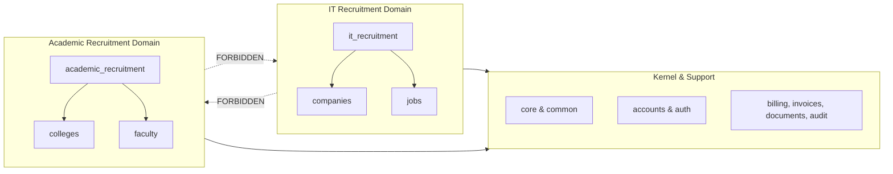

# EduNaukri Codebase Reference (`antigravity.md`)

> **Authoritative Reference for AI Assistance (Antigravity IDE)**  
> This document stores the architectural rules, domain structures, functional boundaries, design tokens, and color palettes of the **EduNaukri** platform. Whenever implementing new features, modifying existing modules, or refactoring code, consult this file to ensure strict compliance with established system patterns.

---

## 1. Executive Summary & Purpose

**EduNaukri** is an enterprise recruitment platform designed to serve two distinct, mutually exclusive recruitment markets:
1. **IT Recruitment**: Connecting technology professionals (Job Seekers) with IT Companies and Recruiters.
2. **Academic & Engineering Faculty Recruitment**: Connecting educators/professors with educational institutions (Colleges, K-12 Schools, Universities, and EdTech companies).

### Core Architectural Axioms
- **Strict Layered Architecture**: Views orchestrate HTTP; Services execute business logic and transactions; Repositories handle database writes; Selectors handle database reads.
- **Dual-Domain Isolation**: The IT Recruitment domain and Academic Recruitment domain are strictly isolated. Entity apps in one domain must **never** import models, repositories, or services from the other domain.
- **Uniform API Envelope**: All API endpoints return structured JSON envelopes: `{ "success": true, "data": ... }` or `{ "success": false, "error": ... }`.
- **Minimalist High-End Aesthetics**: A curated design system ("Minimalist High-End Education") combining SaaS-quality precision (Stripe/Linear) with editorial typography and generous whitespace.

---

## 2. Core Architecture & Design Philosophy

The application strictly enforces separation of concerns across layers. **Never violate these boundaries.**

```
[ HTTP Request ] 
       │
       ▼
┌──────────────┐      ┌─────────────────────────┐
│  Views / API │ ───► │  Serializers / Forms    │ (Validation & Mapping)
└──────┬───────┘      └─────────────────────────┘
       │
       ▼
┌──────────────┐      ┌─────────────────────────┐
│   Services   │ ───► │   Domain Rules / Outbox │ (Business Logic & Transactions)
└──────┬───────┘      └─────────────────────────┘
       │
       ├─── Writes ───────────────┐
       ▼                          ▼
┌──────────────┐          ┌──────────────┐
│ Repositories │          │  Selectors   │
└──────┬───────┘          └──────┬───────┘
       │                         │
       └───────────┬─────────────┘
                   ▼
         [ PostgreSQL / SQLite ]
```

### 2.1 Layer Responsibilities

| Layer | Location | Responsibilities & Restrictions |
| :--- | :--- | :--- |
| **Views / API** | `apps/*/views/`, `apps/*/api/` | Thin orchestrators. Receive requests, invoke Serializers/Forms for input validation, call **Services** for actions or **Selectors** for reads, and return formatted responses. Extend `EnvelopeAPIView` for REST APIs. **No ORM queries or business logic.** |
| **Services** | `apps/*/services/` | Contain **all** business logic, workflow orchestration, and database transactions (`@transaction.atomic` / `@BaseService.atomic`). Coordinate between repositories, selectors, and cross-domain services. |
| **Repositories** | `apps/*/repositories/` | **Write-side persistence only.** Extend `BaseRepository` / `CRUDRepository`. Handle `create()`, `update()`, `soft_delete()`, and `restore()`. **No business rules or complex filtering.** |
| **Selectors** | `apps/*/selectors/` | **Read-side query optimization.** Extend `BaseSelector` / `ReadSelector`. Return querysets, lists, or details needed by views or dashboards without leaking raw ORM chaining into views. |
| **Serializers** | `apps/*/serializers/` | DRF input/output mapping. Perform syntactic and data-type validation. Delegate complex domain validation to Services or `validators/`. |
| **Signals & Tasks** | `signals.py`, `tasks.py` | Must remain thin delegates. Signals catch Django ORM events and immediately invoke appropriate Services. |

### 2.2 Shared Infrastructure (`apps.core`)
All reusable platform primitives live in `apps.core`. **Never duplicate these across domain apps.**
- **Models (`apps.core.models`)**:
  - `BaseModel`: Default domain entity with UUID primary key, timestamp mixins (`created_at`, `updated_at`), and soft-delete capabilities (`is_deleted`, `deleted_at`).
  - `AuditedBaseModel`: Extends `BaseModel` with `created_by`, `updated_by`, and `deleted_by` user references.
  - `StatusModel`: For entities with lifecycle state machines (`RecordStatus`).
  - `OwnershipModel`: For polymorphic resource scoping (`owner_type`, `owner_id`).
- **Exceptions (`apps.core.exceptions`)**:
  - Domain layer exceptions: `ValidationException`, `BusinessLogicException`, `PermissionDeniedException`, `ResourceNotFoundException`, `ConflictException`.
  - Automatically caught by `custom_exception_handler` and converted into HTTP error envelopes with appropriate status codes (400, 401, 403, 404, 409, 500).
- **Middleware (`apps.core.middleware`)**:
  - `RequestIDMiddleware`: Generates and propagates correlation IDs (`X-Request-ID`).
  - `TimezoneMiddleware`: Activates user/request timezones (`X-Timezone`).
  - `RequestLoggingMiddleware`: Structured request/response logging.
  - `SecurityHeadersMiddleware`: Enforces modern HTTP security headers.
  - `ExceptionMiddleware`: Guaranteed JSON error fallback for unhandled 500 exceptions.

---

## 3. Domain Isolation & Dependency Rules

EduNaukri operates two distinct marketplaces on a single kernel. To prevent spaghetti dependencies and maintain clean bounded contexts, dependency rules are strictly policed.

### 3.1 Allowed vs. Forbidden Dependencies



### 3.2 Strict Dependency Rules
1. **Direct Communication Allowed**:
   - Any app $\rightarrow$ `core`, `common` (direct import).
   - Any app $\rightarrow$ `accounts` (via Services/Selectors only; never import User models directly in views).
   - Any app $\rightarrow$ `documents`, `audit`, `search`, `notifications` (via Services only).
   - `invoices` $\rightarrow$ `billing` (via Services).
   - `guarantee_claims` $\rightarrow$ `billing`, `invoices` (via Services).
2. **Service-Layer Communication Required**:
   - Domain Orchestrators (`it_recruitment`, `academic_recruitment`) $\rightarrow$ Entity Apps (`companies`, `jobs`, `colleges`, `faculty`, `applications`).
   - Cross-aggregate actions must invoke the target aggregate's Service.
3. **Completely Forbidden**:
   - **IT Domain $\leftrightarrow$ Faculty Domain**: `it_recruitment`, `companies`, or `jobs` must **never** import from `academic_recruitment`, `colleges`, or `faculty` (and vice versa).
   - **Entity App $\leftrightarrow$ Entity App**: `companies` must never import from `colleges`; `jobs` must never import from `faculty`.
   - **Direct Model/Repo Access Across Apps**: No app may instantiate or query another app's Repository or ORM Model directly. Always go through the public `services/` or `selectors/` layer.

---

## 4. Comprehensive App Catalog

| App Name | Domain / Layer | Responsibilities & Key Components |
| :--- | :--- | :--- |
| **`core`** | Platform Kernel | Base models (`BaseModel`, mixins), exception hierarchy, custom exception handler, uniform JSON renderers, pagination (`StandardResultsSetPagination`, etc.), middleware, base repositories/services/selectors. |
| **`common`** | Shared Support | Cross-domain helper functions, shared validators (GST, phone, URL, email, file upload), standardized response formatters. |
| **`accounts`** | Identity / Security | User models (`AdminUser`, `ITUser`, `ProfessorUser`, `CollegeUser`), role management (`ITUserRole`), JWT token backends, email verification, password reset tracking. |
| **`authentication`** | Security Flows | Registration, login, logout, password reset, and session authentication workflows separated by actor type (`seeker`, `recruiter`, `professor`, `college`, `admin`). |
| **`it_recruitment`** | IT Domain Orchestration | Coordinates IT workflows. Orchestrates seeker profiles (`JobSeekerProfile`), recruiter profiles (`RecruiterProfile`), job publishing, and placement orchestration. |
| **`companies`** | IT Entity Aggregate | IT company profiles (`Company`), verification workflows, and company team member management (`CompanyMember`). |
| **`jobs`** | IT Entity Aggregate | Job postings (`JobPosting`), skill requirements (`JobPostingSkill`, `Skill`), and candidate saved jobs (`SavedJob`). |
| **`academic_recruitment`** | Faculty Orchestration | Coordinates academic hiring workflows. Managing professor profiles and college hiring onboarding. |
| **`colleges`** | Faculty Entity Aggregate | Educational institution profiles (`College`), institutional verification, team members (`CollegeMember`), and departments (`Department`). |
| **`faculty`** | Faculty Entity Aggregate | Faculty vacancies (`FacultyVacancy`), department mappings (`VacancyDepartment`), and saved vacancies (`SavedVacancy`). |
| **`applications`** | Shared Commerce/Ops | Candidate application aggregates for both domains (`JobApplication`, `FacultyApplication`), status state machines (`ApplicationStatus`), and immutable status transition history. |
| **`billing`** | Commerce | Fee schedule definitions (`FeeSchedule`) and automated placement fee calculation (`PlacementFee`) triggered when applications reach `"placed"` status. |
| **`invoices`** | Commerce | Invoice generation (`Invoice`), line items (`InvoiceLineItem`), and payment tracking records (`PaymentRecord`). |
| **`guarantee_claims`** | Commerce | Management of placement guarantee claims (`GuaranteeClaim`) and administrative review workflows. |
| **`documents`** | Infrastructure | Centralized metadata tracking for uploaded files (`StoredFile`). Abstraction layer supporting Local filesystem and S3 storage backends. |
| **`search`** | Infrastructure | Cross-domain search orchestration using PostgreSQL full-text search (Phase 1) and Elasticsearch stubs (Phase 2). Delegates to domain selectors. |
| **`audit`** | Security / Compliance | Append-only immutable audit logging (`AuditEvent`). Captures actor, action, timestamp, IP address, and metadata via thread-local middleware context. |
| **`notifications`** | Infrastructure | In-app notifications and transactional outbox pipeline (`OutboxService`, `OutboxProcessorService`) for reliable email and event delivery. |
| **`reports`** | Analytics | Analytical queries, dashboard metric selectors (`DashboardMetricsSelector`, `PlatformKPIsSelector`), and data export utilities. Read-only across all domains. |
| **`dashboard`** | Web UI Routing | Routes authenticated users to role-specific web dashboards (`/it/dashboard/seeker/`, `/faculty/dashboard/professor/`, `/admin/dashboard/`). |
| **`api`** | API Gateway | Composition root for versioned REST APIs. Mounts all domain routers under `/api/v1/`. |
| **`health`** | DevOps | Liveness (`/api/v1/health/`) and readiness (`/api/v1/health/ready/`) operational probes. |

---

## 5. Design System & Visual Identity ("Minimalist High-End Education")

The visual design is anchored in "Minimal Luxury," blending high-end SaaS precision (Stripe, Linear) with editorial typography and generous whitespace. It evokes calm authority, sophistication, and speed.

### 5.1 Color Palette & Design Tokens
When creating or modifying web interfaces, strictly utilize these defined CSS Custom Properties (available in `static/css/styles.css` and configured in Tailwind via `code.html`). **Never use ad-hoc hex codes or generic colors.**

#### Brand & Surface Spectrum
| Token Name | Hex Value | Usage & Meaning |
| :--- | :--- | :--- |
| `--ed-background` | `#fcf8ff` | Primary page background (warm, sophisticated off-white). Reduces eye strain while feeling premium. |
| `--ed-surface` | `#fcf8ff` | Base surface color for sections and primary containers. |
| `--ed-surface-dim` | `#dcd8e5` | Dimmed surface for secondary backgrounds and dividers. |
| `--ed-surface-bright` | `#fcf8ff` | Highlighted surface for elevated cards. |
| `--ed-surface-container-lowest` | `#ffffff` | Pure white background for Level 1 cards, modals, and input fields. |
| `--ed-surface-container-low` | `#f5f2ff` | Soft tinted container background (e.g., search bars, featured sections). |
| `--ed-surface-container` | `#f0ecf9` | Default container background for nested UI elements and avatars. |
| `--ed-surface-container-high` | `#eae6f4` | Elevated container fill for hover states and badges. |
| `--ed-surface-container-highest`| `#e4e1ee` | Highest contrast container fill for pressed states or borders. |

#### Typography & Outline Colors
| Token Name | Hex Value | Usage & Meaning |
| :--- | :--- | :--- |
| `--ed-on-background` | `#1b1b24` | Primary heading and body text color (Deep Slate/Violet-Black instead of harsh pure black). |
| `--ed-on-surface` | `#1b1b24` | Surface primary text. |
| `--ed-on-surface-variant`| `#464555` | Secondary text, subheadings, metadata, and labels. |
| `--ed-outline` | `#777587` | Strong borders, icons, and input field borders. |
| `--ed-outline-variant` | `#c7c4d8` | Subtle card borders, dividers, and decorative lines. |

#### Primary Spectrum (Indigo to Violet)
| Token Name | Hex Value | Usage & Meaning |
| :--- | :--- | :--- |
| `--ed-primary` | `#3525cd` | Primary brand identity, high-intent call-to-action buttons, active links. |
| `--ed-on-primary` | `#ffffff` | Text/icons on primary background. |
| `--ed-primary-container` | `#4f46e5` | Secondary call-to-action fills, subscribed buttons, gradient stops. |
| `--ed-on-primary-container` | `#dad7ff` | Text on primary container surfaces. |
| `--ed-inverse-primary` | `#c3c0ff` | Primary accents on dark/inverse backgrounds. |

#### Secondary Spectrum (Violet & Purple)
| Token Name | Hex Value | Usage & Meaning |
| :--- | :--- | :--- |
| `--ed-secondary` | `#712ae2` | Secondary brand accents, feature highlights, institution badges. |
| `--ed-on-secondary` | `#ffffff` | Text on secondary background. |
| `--ed-secondary-container`| `#8a4cfc` | Vibrant secondary containers and promotional banners. |
| `--ed-on-secondary-container`| `#fffbff`| Text on secondary container surfaces. |

#### Tertiary Spectrum (Warm Amber / Brown)
| Token Name | Hex Value | Usage & Meaning |
| :--- | :--- | :--- |
| `--ed-tertiary` | `#7e3000` | Warm accent for specific status alerts, special badges, and metrics. |
| `--ed-tertiary-container` | `#a44100` | Strong warm accent containers (e.g., rating stars). |

#### Accents, Status & Neutral Slates
| Token Name | Hex Value / Value | Usage & Meaning |
| :--- | :--- | :--- |
| `--ed-accent-teal` | `#14b8a6` | Success states, badges, and refreshing contrast against primary indigo. |
| `--ed-error` | `#ba1a1a` | Error messages, failed validations, destructive actions. |
| `--ed-gradient-btn` | `linear-gradient(90deg, #4f46e5 0%, #7c3aed 100%)` | Premium CTA button gradient (Indigo to Violet). |
| `--ed-gradient-icon` | `linear-gradient(135deg, #4f46e5 0%, #14b8a6 100%)` | Feature icon background gradient (Indigo to Teal). |
| `--ed-slate-50` to `600` | `#f8fafc` to `#475569` | Neutral slate scale for input backgrounds, subtle cards, and secondary text. |

#### Chip & Badge Palettes
- **Green (Salary/Success)**: Background `#dcfce7`, Text `#166534` (`--ed-chip-green-*`)
- **Blue (Job Type/Info)**: Background `#eff6ff`, Text `#2563eb` (`--ed-chip-blue-*`)
- **Purple (Experience/Domain)**: Background `#faf5ff`, Text `#9333ea` (`--ed-chip-purple-*`)
- **Amber (Institution Type)**: Background `#fffbeb`, Text `#d97706` (`--ed-chip-amber-*`)
- **Slate (Location/Neutral)**: Background `#f1f5f9`, Text `#475569` (`--ed-chip-slate-*`)

---

### 5.2 Typography System
The platform utilizes **Plus Jakarta Sans** exclusively for its modern, geometric structure and approachable roundness.

| Category | CSS Class / Token | Font Size | Font Weight | Line Height | Letter Spacing | Usage |
| :--- | :--- | :--- | :--- | :--- | :--- | :--- |
| **Display XL** | `.ed-display-xl` (`--ed-fs-display-xl`) | `64px` | `800` (ExtraBold) | `1.1` | `-0.04em` | Hero titles, major landing banners. |
| **Display LG** | `.ed-display-lg` (`--ed-fs-display-lg`) | `48px` | `700` (Bold) | `1.2` | `-0.03em` | Section headers, major value propositions. |
| **Headline LG**| `.ed-headline-lg` (`--ed-fs-headline-lg`) | `32px` | `700` (Bold) | `1.3` | `-0.02em` | Card grid titles, dashboard section headers. |
| **Headline MD**| `.ed-headline-md` (`--ed-fs-headline-md`) | `24px` | `600` (SemiBold) | `1.4` | `-0.01em` | Job titles, institution names on feature cards. |
| **Body LG** | `.ed-body-lg` (`--ed-fs-body-lg`) | `18px` | `400` (Regular) | `1.6` | `0` | Introductory paragraphs, lead text, testimonials. |
| **Body MD** | `.ed-body-md` (`--ed-fs-body-md`) | `16px` | `400` (Regular) | `1.6` | `0` | Standard body text, descriptions, form input values. |
| **Label MD** | `.ed-label-md` (`--ed-fs-label-md`) | `14px` | `600` (SemiBold) | `1.0` | `+0.02em` | Button text, form labels, navigation links, category markers. |
| **Caption** | `.ed-caption` (`--ed-fs-caption`) | `12px` | `500` (Medium) | `1.4` | `0` | Timestamps, applicant counts, minor metadata. |

---

### 5.3 Layout, Spacing & Grid System
- **Base Grid**: Centered container with a maximum width of `1280px` (`--ed-container-max`). Uses a 12-column grid on desktop with `24px` gutters (`--ed-gutter`). On mobile, collapses to a single column with `20px` side margins (`--ed-margin-mobile`).
- **The Power of Whitespace**: Major landing page sections use `8rem` (`128px` / `--ed-space-2xl`) vertical padding to give content room to breathe and maintain editorial luxury.
- **Spacing Rhythm**: All dimensions and margins must be multiples of the `4px` base unit (`--ed-space-xs`: 8px, `--ed-space-sm`: 16px, `--ed-space-md`: 24px, `--ed-space-lg`: 40px, `--ed-space-xl`: 64px, `--ed-space-2xl`: 128px).

---

### 5.4 Elevation, Depth & Shapes
- **Corner Radii**:
  - `24px` (`1.5rem` / `--ed-radius-xl`): Primary feature cards, search containers, modal popups.
  - `16px` (`1rem` / `--ed-radius-lg`): Secondary cards, dropdown menus, user profile blocks.
  - `12px` (`0.75rem` / `--ed-radius-md`): Interactive elements (buttons, form input fields, icon containers).
  - `9999px` (`--ed-radius-full`): Pills, badges, status chips, primary CTA buttons, user avatars.
- **Shadows & Glassmorphism**:
  - **Level 1 (Cards)**: `--ed-shadow-premium` (`0 4px 20px -2px rgba(15, 23, 42, 0.05)`).
  - **Level 2 (Hover/Modals)**: `--ed-shadow-sophisticated-hover` (`0 24px 48px -12px rgba(15, 23, 42, 0.16)`).
  - **Glassmorphism (`.ed-glass-card` / `.glass-card`)**: Floating navigation bars and statistical floating elements use a backdrop blur of `20px` (`backdrop-filter: blur(20px)`) with a semi-transparent white fill (`rgba(255, 255, 255, 0.8)`) and a subtle hairline border (`1px solid rgba(0, 0, 0, 0.05)`).

---

### 5.5 Component Styling Rules
- **Buttons (`.ed-btn`)**:
  - Primary CTA buttons use `.ed-btn--primary` (`#3525cd`) or `.ed-btn--gradient` (Indigo to Violet gradient).
  - Hover states must trigger a subtle scale-up (`transform: scale(1.05)`) and enhanced shadow spread rather than a simple color shift.
- **Form Inputs**:
  - Background: Soft Slate-100 (`#f1f5f9` / `--ed-surface-container-low`) with no border by default.
  - Focus state: Transition to pure white background (`#ffffff`) with a `2px` ring of primary indigo (`--ed-primary`) and outline removal.
- **Cards & Lists**:
  - Feature cards use pure white backgrounds (`#ffffff`), `24px` rounded corners, subtle hairline borders (`1px solid #e5e7eb`), and smooth hover lift (`transform: translateY(-8px)`).
  - Lists use generous vertical padding (`16px+`) between items separated by hairline dividers (`1px solid #f1f5f9`).

---

## 6. Frontend Stack & UI Templates

EduNaukri uses a hybrid frontend architecture:
1. **Server-Rendered Django Templates (`templates/`)**:
   - Uses Django template inheritance rooted in `templates/base.html`.
   - Integrates Bootstrap 5.3.3 CSS + Bootstrap Icons as a baseline grid/utility framework.
   - Applies the custom design system via `static/css/styles.css` (2,400+ lines of design token implementations, portal components, and responsive rules) and domain-specific stylesheets (`jobseeker-dashboard.css`, `recruiter-dashboard.css`, `institution-marketplace.css`, `auth.css`, etc.).
2. **Interactive Javascript (`static/js/`)**:
   - Vanilla JavaScript for UI interactions, notification polling (`edu-notify.js`), and dynamic AJAX actions like saving jobs (`saved-jobs.js`).
3. **Reference Prototyping (`code.html`)**:
   - Contains a standalone Tailwind CSS reference implementation of the high-end design system, demonstrating exact HTML component structures for Hero banners, Bento grids, job cards, and interactive timelines.

---

## 7. Development & Implementation Guide for AI Assistance

Whenever the user requests a new feature, code modification, or bug fix, adhere strictly to the following systematic workflow:

### 7.1 Pre-Implementation Checklist
1. **Identify Bounded Context**: Determine if the task belongs to **IT Recruitment**, **Academic Recruitment**, **Commerce/Ops** (`billing`, `applications`), or **Kernel** (`core`, `common`).
2. **Verify Domain Isolation**: Ensure your proposed changes do not introduce cross-domain imports or dependencies. If an IT feature needs faculty data, stop and re-architect—they must remain separate.
3. **Check Knowledge Items (KIs)**: Always review any active KIs or existing patterns in similar domain apps before inventing new structures.

### 7.2 Step-by-Step Implementation standards
- **Step 1: Data Model (`models/`)**:
  - Inherit from `BaseModel` (or `AuditedBaseModel` / `StatusModel`).
  - Define explicit `related_name` attributes on ForeignKeys.
  - Keep models clean; place query filtering methods in Managers/Selectors.
- **Step 2: Write Persistence (`repositories/`)**:
  - Create a repository class extending `BaseRepository` or `CRUDRepository`.
  - Implement data creation, updates, and soft deletions here. **No business logic.**
- **Step 3: Read Queries (`selectors/`)**:
  - Create a selector class extending `BaseSelector` or `ReadSelector`.
  - Implement optimized read querysets (`select_related`, `prefetch_related`) for views and APIs.
- **Step 4: Business Logic & Transactions (`services/`)**:
  - Create a service class extending `BaseService`.
  - Wrap multi-step database operations or cross-repository actions in `@BaseService.atomic` or `@transaction.atomic`.
  - Raise domain exceptions from `apps.core.exceptions` (`ValidationException`, `ResourceNotFoundException`, etc.) on failure.
- **Step 5: API & Serialization (`serializers/`, `views/`, `api/`)**:
  - Write clean DRF serializers for input validation and output formatting.
  - In views/viewsets, extend `EnvelopeAPIView` or use `success_response` / `error_response` utilities. Delegate all execution to the Service layer.
- **Step 6: User Interface & Styling (`templates/`, `static/css/`)**:
  - If rendering HTML, strictly use classes and tokens defined in `styles.css` (`.ed-btn--primary`, `.ed-glass-card`, `.ed-headline-md`, etc.).
  - Ensure generous spacing and smooth micro-animations (`hover:scale-105`, shadow transitions) matching the Minimalist High-End aesthetic.

### 7.3 Testing Standards
- All new services, repositories, selectors, and views must be accompanied by tests in the app's `tests/` directory (`unit/`, `integration/`, `api/`).
- Use `pytest` with `@pytest.mark.django_db` for database integration tests.
- Maintain or increase the project's test suite pass rate (currently 57+ passing domain/infrastructure tests).
- When verifying, run: `python -m pytest tests/ apps/<app_name>/tests/`.

### 7.4 Security & Storage Reminders
- **File Uploads**: Always route file storage through `apps.documents.services.StorageService` and validate using `validate_file_upload` / `validate_image_upload`. Store only the UUID reference in domain tables.
- **Audit Logging**: For sensitive administrative or financial actions, ensure events are recorded via `AuditService` (utilizing thread-local context from `AuditContextMiddleware`).
- **Outbox Notifications**: Never send emails or notifications synchronously during a transaction. Publish events to `OutboxService` to be processed asynchronously by the outbox background processor.

---
*End of Codebase Reference. Keep this document updated as system architecture or design tokens evolve.*
