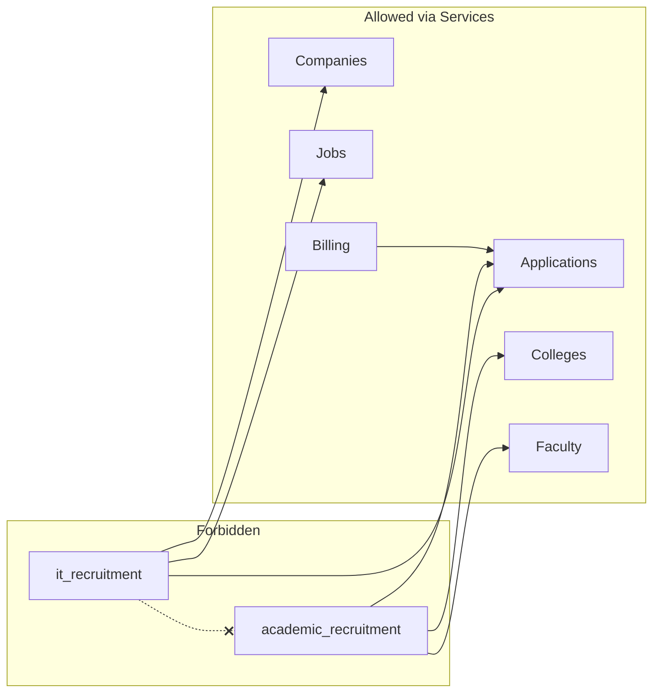

# Edunaukri — Enterprise Project Skeleton

**Status:** Core infrastructure, authentication, onboarding, and domain APIs implemented.  
**Tests:** 57+ passing  
**Scaffold script:** `scripts/scaffold_apps.py`

---

## 1. Project Tree (Complete)

```
edunaukri/
├── config/                         # Project configuration
│   ├── settings/                   # base, development, production
│   ├── urls.py                     # Root URLConf (admin, api, docs)
│   ├── urls_web.py                 # Web dashboard routes (Phase 1)
│   ├── asgi.py / wsgi.py / celery.py / routing.py / logging.py
├── apps/
│   ├── core/                       # Platform kernel ✅
│   ├── common/                     # Cross-domain shared helpers
│   ├── accounts/                   # Identity models & auth backends ✅
│   ├── authentication/             # Login/register/reset flows
│   ├── documents/                  # File storage metadata (storage_file)
│   ├── search/                     # Search orchestration
│   ├── audit/                      # Immutable audit log
│   ├── notifications/              # Phase 2 notification foundation
│   ├── it_recruitment/             # IT domain orchestration
│   ├── companies/                  # IT company aggregate
│   ├── jobs/                       # IT job posting aggregate
│   ├── academic_recruitment/       # Faculty domain orchestration
│   ├── colleges/                   # College/institution aggregate
│   ├── faculty/                    # Faculty vacancy aggregate
│   ├── applications/               # IT + Faculty applications
│   ├── billing/                    # Placement fees & schedules
│   ├── invoices/                   # Invoice aggregate
│   ├── guarantee_claims/           # Guarantee claim aggregate
│   ├── reports/                    # Analytics & exports
│   ├── dashboard/                  # Dashboard routing & context
│   ├── api/                        # API composition root ✅
│   ├── health/                     # Health probes ✅
│   └── integrations/               # Phase 2 adapters (ai, notifications, payments)
├── templates/                      # Global templates
├── static/                         # Global static assets
├── media/                          # Upload storage (see § Media)
├── tests/                          # Project-level tests
├── scripts/scaffold_apps.py        # Skeleton generator
├── docker/                         # Dockerfile, entrypoint, nginx
└── docs/PROJECT_SKELETON.md        # This document
```

---

## 2. Standard App Internal Structure

Every business app follows this layout:

| Folder | Purpose |
|--------|---------|
| `models/` | ORM models — one module per aggregate root |
| `views/` | Django template views; thin, delegate to services |
| `serializers/` | DRF request/response mapping — no business logic |
| `services/` | **Business logic**, transactions, orchestration |
| `repositories/` | **Write-side** persistence only |
| `selectors/` | **Read-side** optimized queries |
| `permissions/` | DRF/Django permission classes |
| `validators/` | Domain validation rules |
| `managers/` | Custom model managers/querysets |
| `forms/` | Django forms for server-rendered UI |
| `constants/` | Enums, status codes, limits |
| `filters/` | django-filter FilterSets |
| `urls/` | Web URL routes (`web.py`) |
| `api/` | REST API routers |
| `api/v1/` | Version 1 endpoint modules |
| `tests/unit/` | Service/validator unit tests |
| `tests/integration/` | DB integration tests |
| `tests/api/` | API endpoint tests |
| `tests/factories/` | factory_boy factories |
| `tests/fixtures/` | Fixture JSON/YAML |
| `templates/<app>/` | App-scoped HTML templates |
| `static/<app>/` | App-scoped CSS/JS |
| `migrations/` | Django migrations |
| `signals.py` | Domain signals |
| `tasks.py` | Celery tasks (Phase 2) |
| `admin.py` | Django Admin registrations |
| `README.md` | App-specific documentation |

**Root files:** `apps.py`, `__init__.py`, `admin.py`, `signals.py`, `tasks.py`

---

## 3. App Catalog

### 3.1 `core` — Platform Kernel ✅

| Aspect | Detail |
|--------|--------|
| **Purpose** | Shared foundation for all apps |
| **Features** | Base models, exceptions, pagination, renderers, middleware |
| **Models** | BaseModel, UUID/Timestamp/SoftDelete mixins, AuditMixin (Phase 1) |
| **Services** | `BaseService` |
| **Repositories** | `BaseRepository` |
| **Selectors** | `BaseSelector` |
| **Dependencies** | None |
| **Future** | Outbox event model, cache helpers |

### 3.2 `common` — Cross-Domain Helpers

| Aspect | Detail |
|--------|--------|
| **Purpose** | Helpers spanning domains without being kernel |
| **Features** | Response helpers, shared validators |
| **Dependencies** | `core` |
| **Future** | Domain event dataclasses |

### 3.3 `accounts` — Identity ✅

| Aspect | Detail |
|--------|--------|
| **Purpose** | User models, auth backends, JWT |
| **Models** | AdminUser, ITUser, ProfessorUser*, CollegeUser*, ITUserRole, EmailVerification, PasswordReset |
| **Services** | UserManagementService, PasswordService, RoleAssignmentService |
| **Repositories** | AdminUserRepository, ITUserRepository, ProfessorUserRepository, CollegeUserRepository |
| **Permissions** | IsPlatformAdmin, IsITUser, IsProfessor, IsCollege |
| **Dependencies** | `core` |
| **Future** | MFA, OAuth |

*ProfessorUser/CollegeUser — split from FacultyUser in Phase 1 implementation*

### 3.4 `authentication` — Auth Flows

| Aspect | Detail |
|--------|--------|
| **Purpose** | Registration, login, logout, password reset, email verification **views/flows** |
| **Features** | Separate flows per actor (seeker, recruiter, professor, college, admin) |
| **Services** | RegistrationService, LoginService, LogoutService, EmailVerificationService, PasswordResetService |
| **Forms** | Per-actor registration and login forms |
| **URLs** | `/it/login/seeker/`, `/faculty/login/professor/`, etc. |
| **Dependencies** | `accounts`, `core` |
| **Future** | SSO hooks |

### 3.5 `it_recruitment` — IT Domain Orchestration

| Aspect | Detail |
|--------|--------|
| **Purpose** | Coordinate IT domain workflows across entity apps |
| **Features** | Domain rules, cross-entity orchestration (publish job, apply, place) |
| **Services** | ITPlacementOrchestrator, ITModerationService |
| **Dependencies** | `companies`, `jobs`, `applications`, `accounts`, `documents`, `search`, `audit` |
| **Must NOT import** | `colleges`, `faculty`, `academic_recruitment` |

### 3.6 `companies` — IT Companies

| Models | Company, CompanyMember |
| Services | CompanyProfileService, CompanyVerificationService, CompanyMemberService |
| Repositories | CompanyRepository, CompanyMemberRepository |
| Selectors | CompanySearchSelector, CompanyDetailSelector |

### 3.7 `jobs` — IT Job Postings

| Models | JobPosting, JobPostingSkill, Skill (reference), SavedJob |
| Services | JobPostingService, JobPublicationService, JobSkillService |
| Repositories | JobPostingRepository, SkillRepository |
| Selectors | JobSearchSelector, JobListSelector |

### 3.8 `academic_recruitment` — Faculty Domain Orchestration

| Purpose | Coordinate faculty workflows |
| Dependencies | `colleges`, `faculty`, `applications`, `accounts`, `documents`, `search`, `audit` |
| Must NOT import | `companies`, `jobs`, `it_recruitment` |

### 3.9 `colleges` — Institutions

| Models | College, CollegeMember, Department (reference) |
| Services | CollegeProfileService, CollegeVerificationService |

### 3.10 `faculty` — Faculty Vacancies

| Models | FacultyVacancy, VacancyDepartment, SavedVacancy |
| Services | VacancyPostingService, VacancyPublicationService |

### 3.11 `applications` — Applications (Both Domains)

| Models | JobApplication, JobApplicationStatusHistory, FacultyApplication, FacultyApplicationStatusHistory |
| Services | JobApplicationService, FacultyApplicationService, ApplicationTrackingService, StatusTransitionService |
| Validators | StatusTransitionValidator (allowed transitions per enum) |
| Subpackages | `services/it/`, `services/faculty/` recommended |

### 3.12 `documents` — Media / File Storage

| Models | StoredFile |
| Services | StorageService, UploadValidationService, FileAccessService |
| Repositories | StoredFileRepository |
| Backends | LocalStorageBackend, S3StorageBackend (config-ready) |

### 3.13 `billing` — Placement Fees

| Models | FeeSchedule, PlacementFee |
| Services | PlacementFeeService, FeeCalculationService, FeeScheduleService |

### 3.14 `invoices` — Invoices

| Models | Invoice, InvoiceLineItem, PaymentRecord |
| Services | InvoiceService, InvoiceGenerationService, PaymentRecordingService |
| Dependencies | `billing` |

### 3.15 `guarantee_claims` — Guarantee Claims

| Models | GuaranteeClaim |
| Services | GuaranteeClaimService, ClaimReviewService |
| Dependencies | `billing`, `invoices` |

### 3.16 `reports` — Reports & Analytics

| Models | ReportDefinition (optional), SearchQueryLog (Phase 2) |
| Services | AnalyticsService, ExportService |
| Selectors | DashboardMetricsSelector, PlatformKPIsSelector |
| Dependencies | All domain selectors (read-only) |

### 3.17 `dashboard` — Dashboard UI Routing

| Purpose | Route users to correct dashboard by role/domain |
| Views | SeekerDashboard, RecruiterDashboard, ProfessorDashboard, CollegeDashboard, AdminDashboard |
| URLs | `/it/dashboard/seeker/`, `/admin/dashboard/`, etc. |
| Dependencies | Domain selectors (read-only) |

### 3.18 `search` — Search Orchestration

| Services | SearchService, FilterService, SortService |
| Backends | PostgreSQLSearchBackend (Phase 1), ElasticsearchBackend (Phase 2 stub) |
| Dependencies | Domain selectors — never domain repositories |

### 3.19 `audit` — Audit Logging

| Models | AuditEvent |
| Services | AuditService (append-only) |
| Repositories | AuditEventRepository |
| Middleware hook | `core.middleware.audit_context` |

### 3.20 `notifications` — Phase 2 Foundation

| Models | NotificationPreference (stub), OutboxEvent* |
| Services | NotificationDispatcherInterface (log-only stub) |
| Tasks | ProcessOutboxTask (Phase 2) |
| Dependencies | `core`, `audit` |

*Outbox may live in `core` per DB architecture*

### 3.21 `api` — API Composition ✅

| Purpose | Mount all domain API routers under `/api/v1/` |
| Structure | `api/urls/`, `api/v1/urls.py` |
| Dependencies | All domain `api/` modules |

### 3.22 `health` — Operational Probes ✅

| Endpoints | `/api/v1/health/`, `/api/v1/health/ready/` |

---

## 4. Shared Modules (`core`)

| Module | Location | Status |
|--------|----------|--------|
| UUID Primary Key Mixin | `core/models/mixins.py` | ✅ Implemented |
| Timestamp Mixin | `core/models/mixins.py` | ✅ Implemented |
| Soft Delete Mixin | `core/models/mixins.py` | ✅ Implemented |
| Base Model | `core/models/base.py` | ✅ Implemented |
| Audit Mixin | `core/models/audit.py` | Skeleton |
| Base Repository | `core/repositories/base.py` | Skeleton |
| Base Service | `core/services/base.py` | Skeleton |
| Base Selector | `core/selectors/base.py` | Skeleton |
| Exception Classes | `core/exceptions/` | ✅ Implemented |
| Exception Handler | `core/exceptions/handlers.py` | ✅ Implemented |
| Pagination | `core/pagination.py` | ✅ Implemented |
| Filter Base | `core/filters/base.py` | ✅ Implemented |
| Permission Base | `core/permissions/base.py` | ✅ Implemented |
| JSON Envelope Renderer | `core/renderers.py` | ✅ Implemented |
| Request ID Middleware | `core/middleware/request_id.py` | ✅ Implemented |
| Security Headers Middleware | `core/middleware/security_headers.py` | ✅ Implemented |
| Audit Context Middleware | `core/middleware/audit_context.py` | Skeleton |
| Storage Helpers | `core/utils/storage.py` | Skeleton |
| Validation Helpers | `common/validators/shared.py` | Skeleton |
| Response Helpers | `common/helpers/responses.py` | Skeleton |

---

## 5. Dependency Matrix

### 5.1 Direct Communication Allowed

| From | To | Via |
|------|-----|-----|
| Any domain app | `core`, `common` | Direct import |
| Any domain app | `accounts` | Services only (not models in views) |
| Any domain app | `documents`, `audit`, `search` | Services |
| Entity apps | Domain orchestrator | Services |
| `invoices` | `billing` | Services |
| `guarantee_claims` | `billing`, `invoices` | Services |
| `dashboard`, `authentication` | Domain apps | **Selectors + Services only** |
| `reports` | All domains | **Selectors only** (read) |
| `api` | All apps | URL includes only |

### 5.2 Service-Layer Communication Required

| From | To | Rule |
|------|-----|------|
| `it_recruitment` | `companies`, `jobs`, `applications` | Service → Service |
| `academic_recruitment` | `colleges`, `faculty`, `applications` | Service → Service |
| `billing` | `applications` | Service reads application UUID + domain — no FK import |
| `admin` operations | Any domain | Administration services call domain services |

### 5.3 Must Remain Completely Independent

| App A | App B | Rule |
|-------|-------|------|
| `it_recruitment` | `academic_recruitment` | **NEVER** direct import |
| `companies` | `colleges` | **NEVER** |
| `jobs` | `faculty` | **NEVER** |
| IT entity apps | Faculty entity apps | **NEVER** |
| Domain apps | `integrations.*` | **NEVER** in Phase 1 |
| Any app | `audit` repositories | Write via AuditService only |



---

## 6. Service Layer Rules

1. **Views** → call **Services** only  
2. **Services** → call **Repositories** (write) and **Selectors** (read)  
3. **Repositories/Selectors** → ORM only  
4. **Serializers** → validate input, call Services, map output  
5. **No business logic** in views, serializers, admin, or signals — signals delegate to services  
6. **Transactions** begin and end in Services (`@transaction.atomic`)  
7. **Cross-app calls** go Service → Service, never Model → Model across apps  

---

## 7. Testing Structure

Every app includes:

```
tests/
├── unit/           # Pure logic: services, validators, utils
├── integration/    # DB: repositories, selectors
├── api/            # DRF APIClient endpoint tests
├── factories/      # factory_boy Factory classes
└── fixtures/       # Static test data
```

**Project-level:** `tests/test_smoke.py` — infrastructure smoke tests ✅

**Conventions:**
- Unit tests: mock repositories  
- Integration tests: `@pytest.mark.django_db`  
- API tests: JWT/session auth fixtures per domain  
- Factories: one factory per model, nested for relationships  

---

## 8. API Structure (Skeleton — Not Implemented)

```
/api/
├── schema/                         # OpenAPI schema
├── docs/                           # Swagger UI
├── redoc/                          # ReDoc
└── v1/
    ├── health/
    ├── auth/
    │   ├── admin/token/
    │   ├── it/token/
    │   ├── professor/token/        # Phase 1
    │   ├── college/token/          # Phase 1
    │   └── token/refresh/
    ├── it/                           # profiles, companies, jobs
    ├── applications/it/
    ├── faculty/                      # profiles, colleges, vacancies, applications
    ├── documents/
    ├── billing/
    ├── invoices/
    ├── guarantee-claims/
    ├── search/
    ├── reports/
    ├── audit/                        # Admin only
    └── notifications/                # Phase 2
```

Mount points in `apps/api/v1/urls.py`. Domain routers mount directly under `/api/v1/{domain}/` (single version prefix).

---

## 9. Security Structure

| Layer | Component | Location |
|-------|-----------|----------|
| Authentication | Session + JWT dual mode | `accounts/authentication/` ✅ |
| Authorization | RBAC permission classes | Per-app `permissions/` |
| Middleware | Request ID, security headers | `core/middleware/` ✅ |
| Middleware | Audit context | `core/middleware/audit_context.py` |
| Rate limiting | DRF throttling | `config/settings/base.py` ✅ |
| Audit logging | Append-only events | `audit/services/` |
| Password policy | Validators | `config/settings/base.py` ✅ |
| File upload security | Type/size validation | `documents/validators/` |

---

## 10. Media Structure

```
media/
├── it/
│   ├── resumes/{user_id}/
│   └── companies/{company_id}/logos/
├── faculty/
│   ├── cvs/{user_id}/
│   ├── certificates/{profile_id}/
│   └── colleges/{college_id}/logos/
├── billing/
│   ├── invoices/{invoice_id}/
│   └── claims/{claim_id}/
└── admin/
    └── exports/
```

All files registered in `documents` → `StoredFile` model. Business tables reference `file_id` UUID only.

---

## 11. Web URL Structure (Skeleton)

```
/admin/                             # Django Admin
/admin/dashboard/                   # Custom admin dashboard
/it/register/seeker/
/it/register/recruiter/
/it/login/seeker/
/it/login/recruiter/
/it/dashboard/seeker/
/it/dashboard/recruiter/
/faculty/register/professor/
/faculty/register/college/
/faculty/login/professor/
/faculty/login/college/
/faculty/dashboard/professor/
/faculty/dashboard/college/
```

Defined in `config/urls_web.py` (commented mounts).

---

## 12. Phase 2 Integration Points

| Capability | Skeleton Location |
|------------|-------------------|
| AI Matching | `apps/integrations/ai/` |
| Resume Parsing | `StoredFile.parsed_data` + `integrations/ai/` |
| Email Automation | `apps/integrations/notifications/` |
| Notification Engine | `apps/notifications/` + Channels consumers |
| Payment Gateway | `apps/integrations/payments/` |
| Celery Tasks | Each app's `tasks.py` |

---

## 13. Implementation Order

1. `documents`, `audit`  
2. Extend `accounts` (professor/college split, roles)  
3. `companies` → `jobs` → `applications` (IT)  
4. `colleges` → `faculty` → `applications` (Faculty)  
5. `search`  
6. `billing` → `invoices` → `guarantee_claims`  
7. `authentication` → `dashboard`  
8. `reports`  
9. Uncomment API and web URL mounts  

---

## 14. Scaffold Maintenance

Regenerate app folders (does not overwrite existing code):

```bash
python scripts/scaffold_apps.py
```

**Note:** Do not create both `module.py` and `module/` package in the same app (Python import shadowing). The scaffold uses packages (`managers/`, `urls/`, `views/`).
